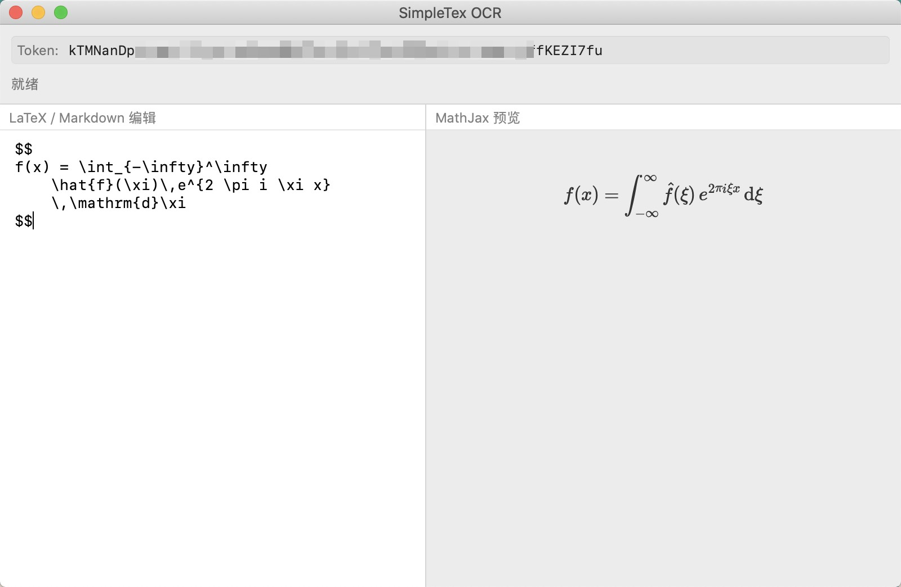

<picture>

</picture>
<h1>SimpleCrop</h1>

SimpleCrop provides an elegant macOS frontend for [simpleTeX](https://simpletex.cn).

The whole application is written in Swift + Appkit, with the size < 1mb.

## Get Started

You need an [simpleTeX](https://simpletex.cn/api_doc) API account, it is free. (< 1000 requests/month)

Login to the API console and get an Auth token, paste into the application.

Then goto settings, give App permission to **record the screen**.

Have fun!

